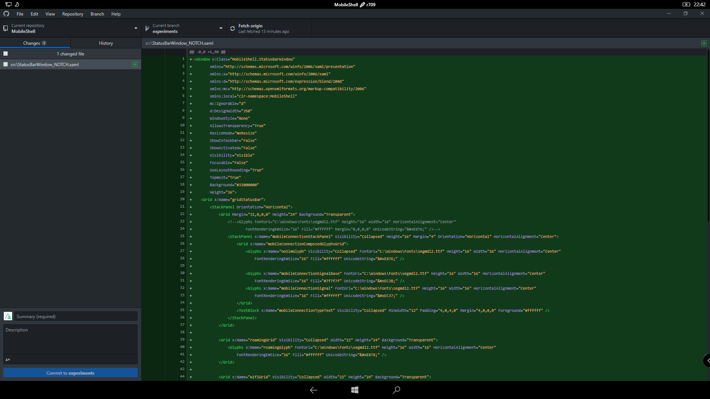
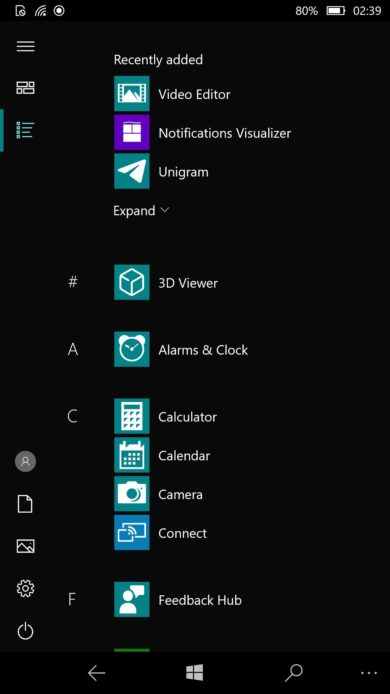

# MobileShell - A custom shell for Windows 10 Desktop/ARM64 (17763+)

### Running on a PC:

### Running on a phone:

## What's new:

- Battery status (charging, normal, saving)
- Detects (like w10m):
    - Focus Assist
    - Location usage
    - WiFi (expected to be partially broken)
    - Cellular (+ dual sim) -> WIP, expected to be broken
    - Tablet mode or Desktop mode (expected to be broken)
    - It may bug explorer.exe, in that case open Task Manager, kill MobileShell, go in Desktop mode and launch MobileShell again.
- Double tap to sleep
- Click/touch the status bar to open the action center

## Issues:

 - No support for rotation -> it will glitch
 - No support for DPI changes -> it will glitch
 - No support for resolution changes --> it will glitch

## Tasks

- [X] Add Battery status
- [X] Add Focus Assist
- [X] Add Location
- [X] Add WiFi
- [X] Add Cellular icon (with basic behavior)
- [X] Add Tablet/Desktop mode changes detection
- [ ] Finish Cellular icon/behavior implementation
- [ ] Fix WiFi icon behavior
- [ ] Fix Tablet/Desktop Mode padding
- [ ] Add support for rotation
- [ ] Add support for DPI changes
- [ ] Add support for resolution changes
- [ ] \(Optional) Fix Tablet\Desktop mode changes behavior (this is kinda hard.)

## License

This project is licensed under the MIT License - see the [LICENSE.md](LICENSE.md) file for details
